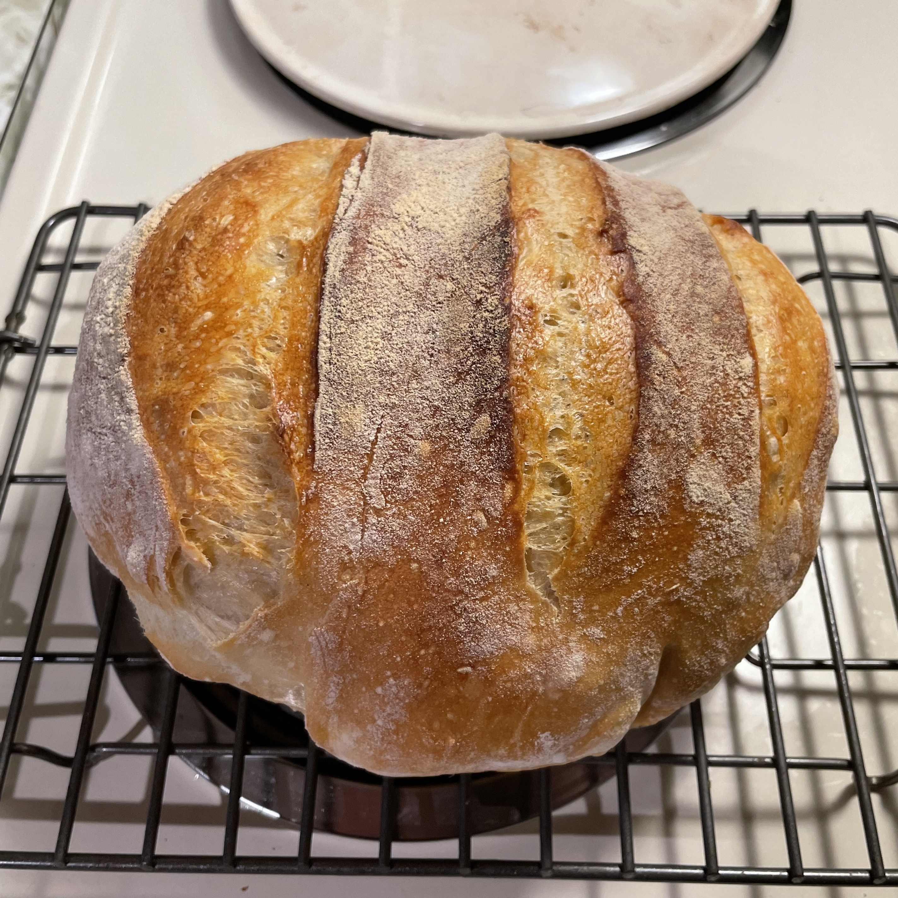
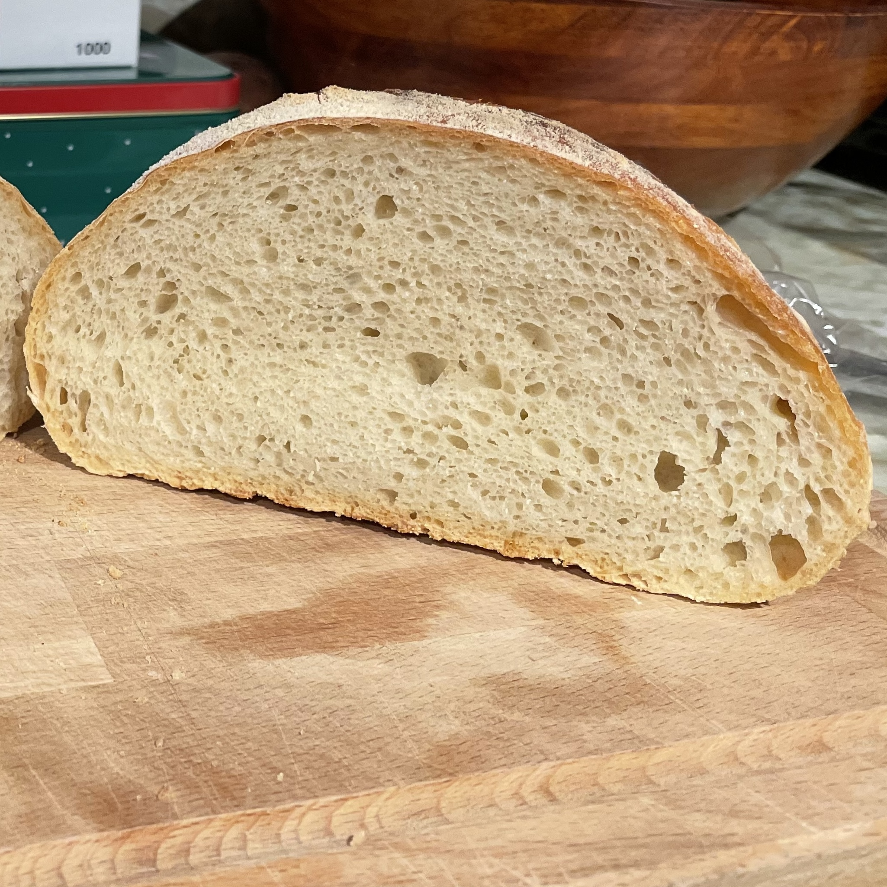

## No Knead Bread

 
### Ingredients

- 400g flour
- 2g yeast
- 10g salt
- 300g water (lukewarm)

### Instructions
Combine flour, yeast, and salt to large bowl and mix. 
Add water and mix until all the dry ingredients are hydrated and a shaggy ball is formed. 
Cover and let rise for at least 12 hours.
Next, wet hands and fold the dough over itself 4-10 times.
Cover and let rise for an hour.
Flour the top of the dough and roll out onto a heavily floured work surface.
Fold the dough over itself from each direction, pinching the final seam together.
Put on a floured parchement surface and cover with a floured towel and let rise for 1 hour.
Preheat the oven to 450F with a dutch oven inside for at least an hour.
Score the top of the dough with a sharp floured knife and put in the dutch oven.
Cover with the lid and bake for 20 minutes.
Remove the lid and then bake for another 20 mins or until the top reaches a dark golden color.

#### Notes
- You can substitute 100g of water for beer to give the bread a little bit more sour flavor.
- If your yeast is old, try blooming it in the water for 5 minutes before adding both to the dry ingredients.

Recipe adapted from [J. Kenji Lopez-Alt](https://www.youtube.com/watch?v=uWbl3Sr2y1Y), who got it from Jim Lahey
