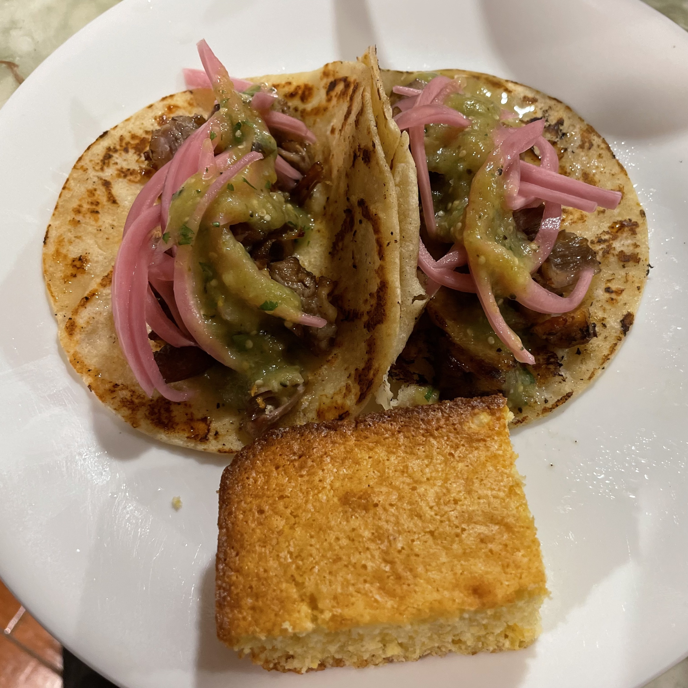
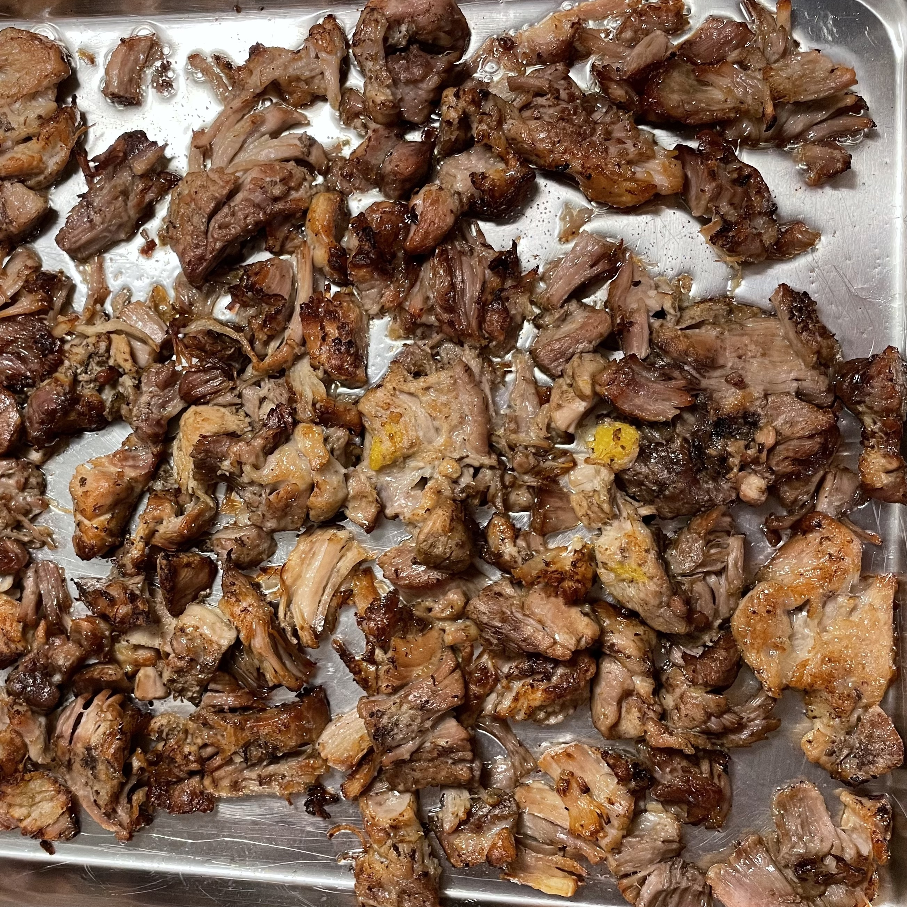
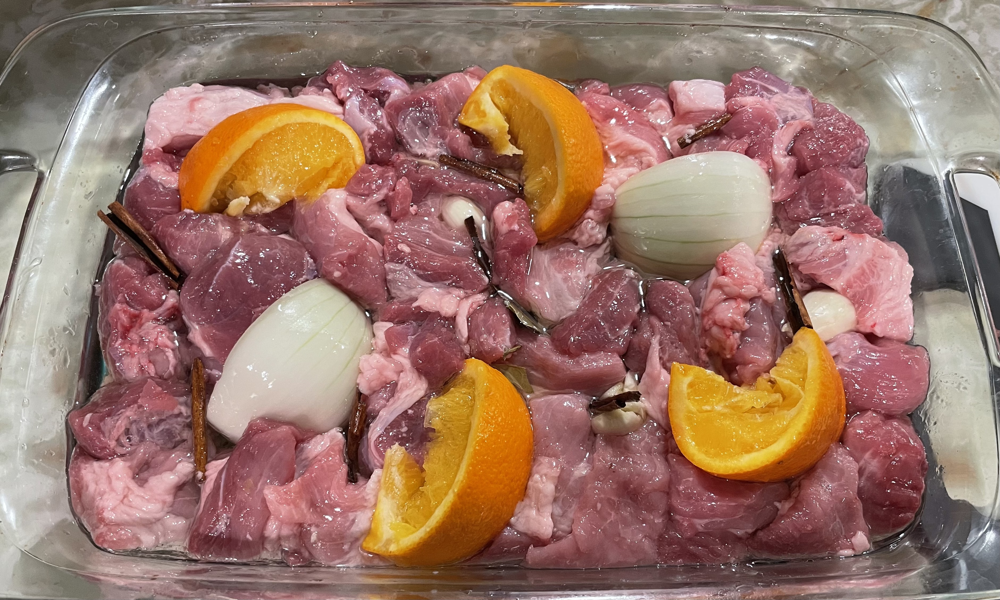

## No Waste Carnitas with Salsa Verde

 

### Ingredients
- 2 medium onions, divided
- 1/2 C (8g) chopped fresh cilantro leaves and tender stems
- 3 lbs boneless pork shoulder, cut into 2-inch cubes
- 1 tbsp (8g) kosher salt, plus more to taste
- 1 medium orange
- 6 cloves garlic, halved, divided
- 2 bay leaves
- 1 cinnamon stick, broken into three or four pieces
- 1/4 C (60ml) vegetable oil
- 6 medium tomatillos (about 1 1/2 pounds, 0.7kg), husks removed and halved
- 2 jalapeño peppers, stem removed and halved lengthwise
- a bunch of cilantro
- 24 corn tortillas
- 1 C (150g) crumbled queso fresco
- 3 limes, cut into wedges

### Instructions
1. Adjust oven rack to middle position and preheat oven to 275°F (135°C). Cut one onion into fine dice and combine with cilantro. Refrigerate until needed. Split remaining onion into quarters. Set aside. Season pork with 1 tablespoon salt and place in a 9- by 13-inch glass baking dish. The pork should fill the dish with no extra space. Split orange into quarters and squeeze juice over pork. Nestle squeezed orange pieces into dish. Add 2 onion quarters, 4 cloves garlic, bay leaves, and cinnamon stick to dish. Nestle everything into an even layer. Pour vegetable oil over surface. Cover dish tightly with aluminum foil and place in oven. Cook until pork is fork tender, about 3 1/2 hours.
2. Set large fine-mesh strainer over a 1-quart liquid measuring cup or bowl. Using tongs, remove and discard orange peel, garlic, cinnamon stick, and bay leaves. Transfer pork, rendered fat, and cooking liquid to strainer. Let drain for 10 minutes. Transfer pork back to baking dish. You should end up with about 1/2 cup cooking liquid and 1/2 cup fat. Using a flat spoon or fat separator, skim fat from surface and add back to pork. Shred pork into large chunks with fingers or two forks. Season to taste with salt. Refrigerate until ready to serve. Transfer remaining cooking liquid to medium saucepan.
3. Add tomatillos, remaining 2 garlic cloves, and jalapeños to sheetpan and broil until skin starts to char. Transfer everything, including juices from pan into saucepan. Add onion from braised pork and blend salsa with immersion blender or in a countertop blender until smooth. Add chopped cilantro and give a quick blend. Season to taste with salt. Allow to cool and refrigerate until ready to use.
4. To serve: Preheat broiler to high with oven rack 4 inches below heating element. Broil pork until brown and crisp on surface, about 6 minutes. Remove pork, stir with a spoon to expose new bits to heat, and broil again until crisp, 6 more minutes. Tent with foil to keep warm.
5. Meanwhile, heat tortillas. Preheat an 8-inch cast iron skillet over medium-high heat until hot. Working one tortilla at a time, dip tortilla in bowl filled with reserved cooking liquid. Transfer to hot skillet and cook until water evaporates from first side and tortilla is browned in spots, about 30 seconds. Flip and cook until dry, about 15 seconds longer. Transfer tortilla to a tortilla warmer, or wrap in a clean dish towel. Repeat with remaining tortillas.
6. To eat, stack two tortillas on top of each other. Add two to three tablespoons carnitas mixture to center. Top with salsa verde, chopped onions and cilantro, and queso fresco. Serve with lime wedges.

Recipe from [J. Kenji Lopez-Alt](https://www.youtube.com/watch?v=JRlmQdRN0G8)