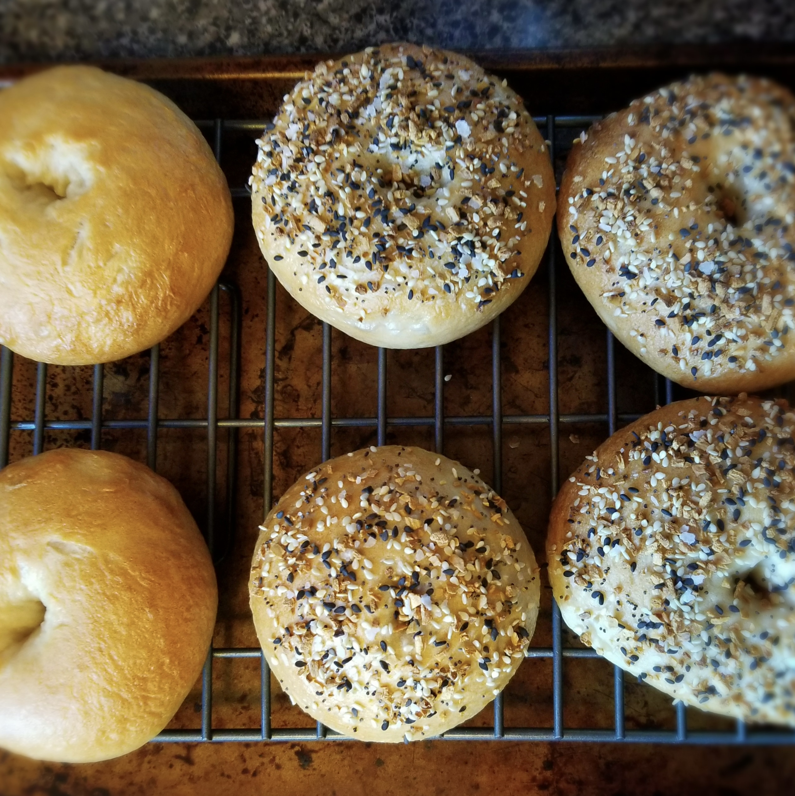

## Everything Bagels

### Ingredients
- 6g yeast
- 19g brown sugar 
- 300mL warm water
- 440g bread flour
- 6g salt
- 1/4 C molasses or barley malt
- 1 tsp baking soda
- everything bagel seasoning

### Instructions
1. In 120mL warm water bloom yeast with sugar for 5 mins
2. Combine salt and flour in bowl and pour in bloomed yeast mixture
3. Pour in 80mL of warm water and mix. Add in the rest of the 100mL water and mix
    - You may need additional water depending on where you live. You want a moist and form dough after mixing
4. Kneed dough for 10 mins
5. Put dough in oiled bowl and roll to coat then cover with damp towel and rest for 1 hour. Then punch dough and let rest for 10 mins
6. Divide dough into 8 pieces and shape into rounds using the countertop
7. Coat finger in flour and poke hole in center of dough and stretch into a ring
8. Place on cookie sheet and cover with damp towel and rest for 10 mins
9. Preheat oven to 425F and bring large pot of water with barley malt or molasses and baking soda to boil. Place bagels in water, flipping after 1 min and removing after 2 min total. 
10. Add topping to bagel immediately then bake for 20-25 mins
11. Cool on wire rack

#### Notes
- 