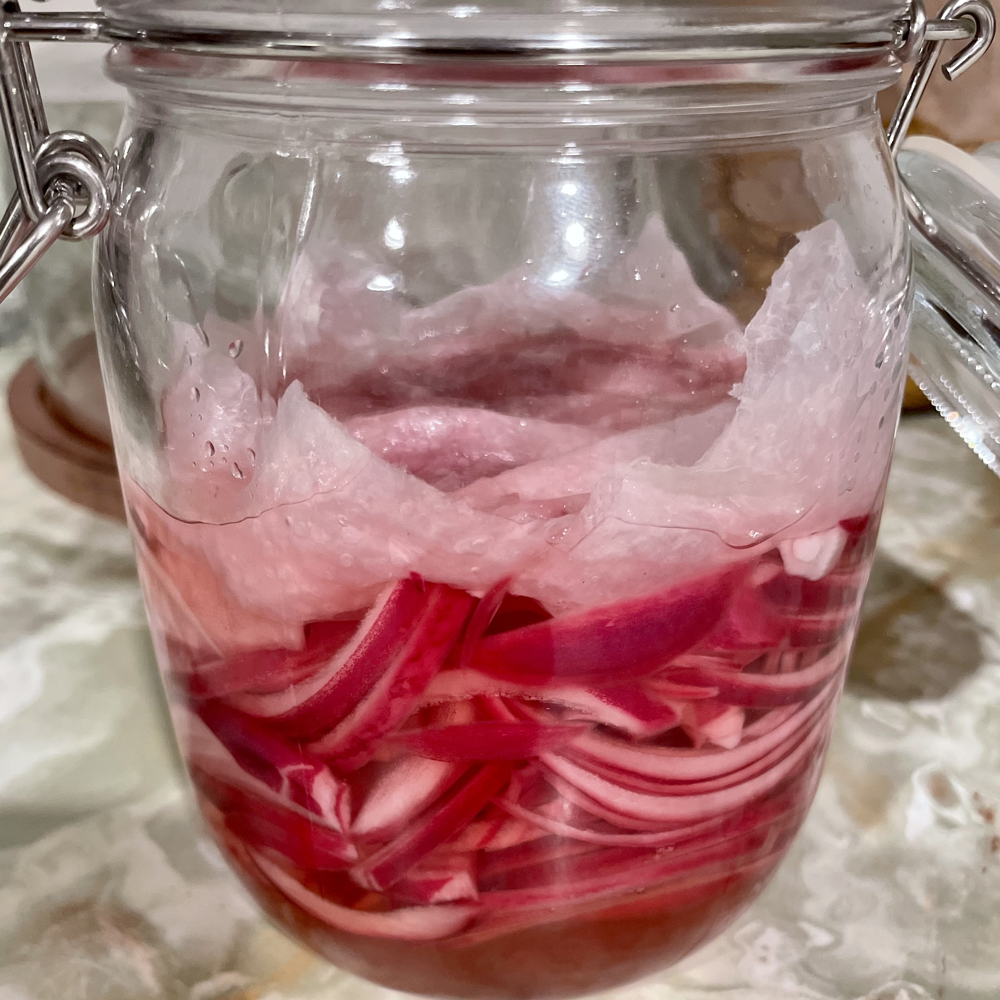

## Quick-Pickled Red Onion

### Ingredients

- 1 large red onion, thinly sliced
- 1/2 C water
- 1/2 C distilled white vinegar
- 1/2 C sugar
- 1 tsp kosher salt

### Instructions
1. Heat vinegar, water, sugar and salt in a saucepan until sugar dissolves and it starts to boil.
2. As the pickling mixture heats, cut the onion in half and peel it. Trim off the tip and root from each piece, then slice thinly and place in a jar
3. Pour the hot liquid over the onions in the jar. If there isn't enough liquid you can add more vinegar so much as it doesn't lower the temperature too much
4. Put paper towel over the onions, making sure to tamp it down so that the air is gone and all the onions are fully submerged
5. Let sit for 25 mins, then remove paper towel, cap it and toss it in the fridge.

#### Notes
- They last for ages but maybe give them a sniff test after a month
- We know they taste great on street tacos, but they also taste great in grilled cheese, on rice and beans, on a breakfast sandwich. Really they taste great on any dish that needs a bit more acidity.
