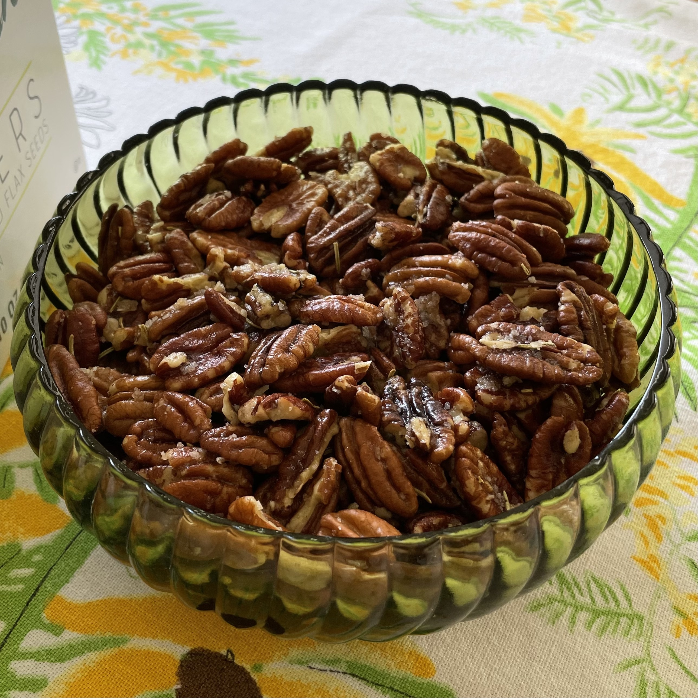

## Rosemary Pecans

### Ingredients
- 4 C pecan halves (1 pound)
- 4 tbsp unsalted butter (melted)
- 1 ½ tsp salt
- 1 tsp dried rosemary (lightly crushed)
- ½ tsp sugar

### Instructions
Preheat the oven to 250°. Spread the pecan halves on a large rimmed baking sheet. Bake them for 15 minutes, shifting the baking sheet halfway through for even coloring, or until they are lightly toasted. Drizzle the melted butter over the pecans, then sprinkle with the salt, rosemary and sugar and toss to coat. Bake the pecans for 15 minutes longer, shifting the pan halfway through, or until browned and crisp. Transfer to paper towels and let cool.